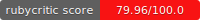

# AnonRequest

Welcome to your new gem! In this directory, you'll find the files you need to be able to package up your Ruby library into a gem. Put your Ruby code in the file `lib/anon_request`. To experiment with that code, run `bin/console` for an interactive prompt.

TODO: Delete this and the text above, and describe your gem

## Status
(Updated with pre commit hook)





## Installation

Add this line to your application's Gemfile:

```ruby
gem 'anon_request'
```

And then execute:

    $ bundle install

Or install it yourself as:

    $ gem install anon_request

## Usage

### Configuration
Create an initializer like `config/initializers/anon_request.rb` and configure it like this
```ruby
AnonRequest.configure do |config|
  config.shell                  = "/bin/zsh"                  # Optional - Default ENV["SHELL"]
  config.sudo_password          = "my_pass"                   # Optional - If need to start openvpn cli
  config.open_vpn_config_path   = "/path"                     # Optional - Default "anon_request/open_vpn/configs" (only .ovpn file will be loaded)
  config.open_vpn_stop_timeout  = 50                          # Optional - Default 10 (max delay to make successful open vpn connection)
  config.anon_ip_delay          = 50                          # Optional - Default 30 (max delay for checking if ip has been changed)
  config.rotation               = 10                          # Optional - Default nil (no rotation) identity rotation for n requests
  config.use_tor                = true                        # Optional - Default false use tor network via sock5 proxy, require tor package installed and started
  config.tor_proxy              = 'socks5://ip.address:port'  # Optional - Default is socks5://127.0.0.1:9050 (default tor proxy server)
end
```

## Development

After checking out the repo, run `bin/setup` to install dependencies. Then, run `rake spec` to run the tests. You can also run `bin/console` for an interactive prompt that will allow you to experiment.

To install this gem onto your local machine, run `bundle exec rake install`. To release a new version, update the version number in `version.rb`, and then run `bundle exec rake release`, which will create a git tag for the version, push git commits and the created tag, and push the `.gem` file to [rubygems.org](https://rubygems.org).

## Contributing

Bug reports and pull requests are welcome on GitHub at https://github.com/[USERNAME]/anon_request.
